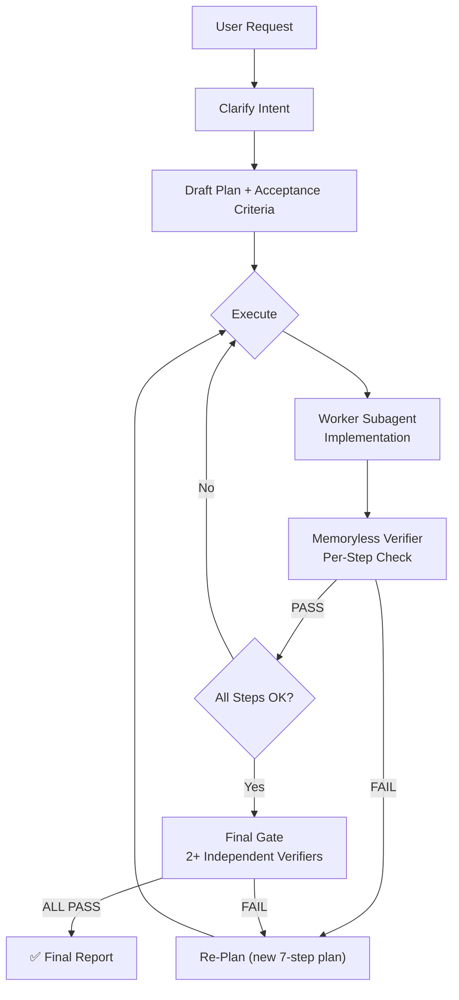

<p align="center">
  
</p>

<h1 align="center">🛡️ Plan Guardian</h1>

<p align="center">
  <strong>Strict planning · Memoryless verification · Subagent-first execution</strong><br/>
  A Codex skill that enforces verifiable planning, then validates completion with independent memoryless subagents.
</p>

<p align="center">
  
  
  
  
</p>

---

## 🎯 What It Does

Plan Guardian is a **Codex skill** that wraps every user request in a strict 7-step planning and verification workflow. Instead of letting Codex respond directly, it forces a closed-loop process: plan → execute → verify → report.

### Core Functionality

| Function | Description |
|----------|-------------|
| **Strict Planning** | Every request produces exactly 7 numbered steps with deliverables, dependencies, and risks |
| **Acceptance Criteria** | Each step gets binary pass/fail criteria defined before execution begins |
| **Worker Delegation** | Implementation is delegated to spawned worker subagents, keeping the main loop lightweight |
| **Memoryless Verification** | Independent verifier subagents (with `fork_context=false`) check each step with zero prior context |
| **Final Gate** | At least 2 independent verifiers check ALL criteria before the response is delivered |
| **Re-Planning Protocol** | On failure, a new plan is drafted (not blind retry) and re-verified until all pass or 3 cycles exhausted |
| **Multimodal Detection** | Step 0 probes the model API to determine image support, then applies the result to all worker/verifier model selections |

### Why Use It?

- Eliminates silent failures on complex tasks
- Prevents self-verification bias (main loop never checks its own work)
- Forces observable, binary acceptance criteria before execution starts
- Scales to multi-file, multi-step tasks with parallel worker subagents

---

## ❓ Why Plan Guardian?

Complex tasks fail silently when plans are loose and verification is shallow. Plan Guardian eliminates that by forcing a **closed-loop workflow**:

- 📐 **Strict Planning** — Every request starts with a numbered plan, dependencies, and acceptance criteria
- 🤖 **Subagent-First** — Main loop stays lightweight; workers and verifiers handle the heavy lifting
- 🔍 **Memoryless Verification** — Independent subagents verify completion with zero prior context
- 🧠 **Multimodal-First** — Workers prefer multimodal models; verifiers always use them
- 🔄 **Re-Planning Protocol** — When verification fails, a new plan is drafted (not blind retry) and re-verified until all pass

---

## 🏗️ Architecture



---

## 🚀 Quick Start

There are **two installation levels**. Choose based on how you want the skill to behave.

### System Level — Auto-activates on every request (Recommended)

**Two files must be installed:**

```bash
# Step 1: Install the skill
# Linux/macOS
cp -r plan-guardian-skill ~/.codex/skills/.system/plan-guardian

# Windows (PowerShell)
robocopy plan-guardian-skill "$env:USERPROFILE\.codex\skills\.system\plan-guardian" /E
```

```bash
# Step 2: Install the global AGENTS.md (REQUIRED for subagent spawning)
# Linux/macOS
cp AGENTS.global.md ~/.codex/AGENTS.md

# Windows (PowerShell)
Copy-Item AGENTS.global.md "$env:USERPROFILE\.codex\AGENTS.md" -Force
```

**Why two files?**
- `SKILL.md` tells Codex WHAT to do (7-step workflow)
- `AGENTS.global.md` tells Codex HOW to do it (spawn subagents, detect multimodal, etc.)
- Without AGENTS.md, the model will plan but NOT spawn workers or verifiers

- Codex loads this on **every request** automatically — no exceptions
- The 7-step workflow (Step 0 → Step 7) applies to all tasks, including simple questions
- Skill appears as `plan-guardian` in Codex's system skills list
- **This is the forced mode — no way to skip it once installed**

### User Level — Manual invocation only

```bash
# Linux/macOS
cp -r plan-guardian-skill ~/.codex/skills/plan-guardian

# Windows (PowerShell)
robocopy plan-guardian-skill "$env:USERPROFILE\.codex\skills\plan-guardian" /E
```

- **Not** automatically activated — you choose when to use it
- Invoke explicitly with `$plan-guardian <your task>`
- Use when you want strict planning only for complex tasks

### Usage (User Level)

```
$plan-guardian implement a multi-file refactoring with tests
```

### Validate Installation

```bash
python scripts/validate_skill.py .
```

---

## 📋 How It Works

| Step | What Happens | Who Does It |
|------|-------------|-------------|
| **0. Detect Model Capabilities** | Probe whether current model supports multimodal (image) input | Diagnostic Subagent |
| **1. Clarify Intent** | Restate user request in one paragraph | Main Loop |
| **2. Draft Plan** | Exactly 7 numbered steps with dependencies, risks, and deliverables | Main Loop |
| **3. Acceptance Criteria** | Binary pass/fail criteria for every step | Main Loop |
| **4. Execute** | Delegate all steps to Worker subagents | **Worker Subagent** |
| **5. Per-Step Verification** | Independent memoryless verifier checks each step | **Verifier Subagent** |
| **6. Final Gate** | ≥2 memoryless verifiers check ALL criteria | **Verifier Subagents** |
| **7. Report** | Present plan, status, evidence, and remediation actions | Main Loop |

---

## 🤖 Subagent Roles

### Planner (Main Loop)
- Clarifies intent, drafts plan, coordinates execution
- **Never** pastes large files or logs — delegates to workers
- **Never** self-verifies — all verification uses spawn_agent

### Worker Subagents
- Implement, build, fix, edit, inspect files, run tests
- **Prefer multimodal model by default** — fall back to parent for pure text/code only
- **Visual rule**: MUST use multimodal model for image/UI/PDF tasks

### Verifier Subagents
- Independent, memoryless (`fork_context=false`)
- Receive only: deliverables + acceptance criteria
- Output: `PASS` or `FAIL` with exact reason
- **Always use multimodal model** — code, files, and artifacts all benefit from visual understanding

---

## 🧠 Model Selection

```
Step 0 detection result:
├── MULTIMODAL    → All workers/verifiers inherit parent model
├── NOT_MULTIMODAL → Visual tasks override to multimodal model; text tasks inherit
└── UNKNOWN       → Assume multimodal, inherit parent model
```

---

## ⏱️ Timeout Rules

| Verifier Type | timeout_ms | Retry |
|---------------|-----------|-------|
| Per-step (Step 5) | 120,000 (2 min) | +60s each retry |
| Final gate (Step 6) | 180,000 (3 min) | +60s each retry |
| Maximum | 360,000 (6 min) | — |

---

## 📁 Structure

```
plan-guardian-skill/
├── SKILL.md                              # Core skill instructions (7-step workflow)
├── AGENTS.md                             # Repo-level agent guidelines
│   ├── AGENTS.global.md                  # Global template (install to ~/.codex/AGENTS.md)
├── agents/
│   └── openai.yaml                       # UI metadata (display name, icon, default prompt)
├── assets/
│   ├── plan-guardian-small.svg           # Small icon
│   ├── logo.png                          # Large icon
│   └── logo.svg                          # Vector logo
├── references/
│   ├── memoryless_review.md              # Strict verifier protocol & independence rules
│   └── plan_protocol.md                  # Acceptance criteria patterns & verifier prompt template
├── scripts/
│   ├── detect_multimodal.py              # Runtime multimodal model detection via API probe
│   ├── plan_guardian.py                  # Sample plan generator (demo/testing)
│   └── validate_skill.py                 # Local validator (checks SKILL.md frontmatter & required files)
├── LICENSE                               # MIT license
└── README.md                             # This file
```

---

## 📜 Hard Rules

1. ✅ Never respond to the user without completing the Final Gate (Step 6)
2. ✅ Never self-verify — all verification uses `spawn_agent` with `fork_context=false`
3. ✅ Never reuse a verifier that returned FAIL — follow the Re-Planning Protocol
4. ✅ Never pass conversation history to verifiers — they get deliverables + criteria only
5. ✅ Never assume a step passed without verifier evidence
6. 🔒 Plan must have **exactly 7 steps** — no shortcuts
7. 🔒 If two final verifiers disagree → spawn a third
8. 🔒 When verification fails → Re-Planning Protocol, never blind retry
9. 🔒 After 3 re-plan cycles → escalate honestly, never silently give up
10. 🔒 If a verifier times out → treat as FAIL, increase timeout by 60s, retry with new verifier

---

## 📄 License

MIT — Use it, fork it, improve it.

---

<p align="center">
  <sub>Built for <a href="https://github.com/openai/codex">Codex</a> · Enforcing rigor since 2026</sub>
</p>
