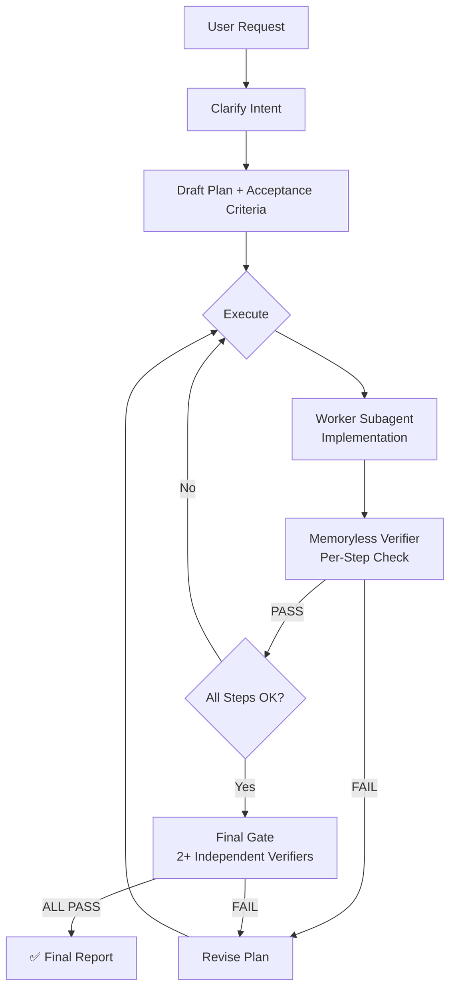

<p align="center">
  
</p>

<h1 align="center">🛡️ Plan Guardian</h1>

<p align="center">
  <strong>Strict planning · Memoryless verification · Subagent-first execution</strong><br/>
  A Codex skill that enforces verifiable planning, then validates completion with independent memoryless subagents.
</p>

<p align="center">
  
  
  
  
</p>

---

## ✨ Why Plan Guardian?

Complex tasks fail silently when plans are loose and verification is shallow. Plan Guardian eliminates that by forcing a **closed-loop workflow**:

- 🎯 **Strict Planning** — Every request starts with a numbered plan, dependencies, and acceptance criteria
- 🤖 **Subagent-First** — Main loop stays lightweight; workers and verifiers handle the heavy lifting
- 🔍 **Memoryless Verification** — Independent subagents verify completion with zero prior context
- 🧠 **Modal-Aware** — Automatically uses multimodal models when visual artifacts are involved
- 🔄 **Auto-Revision Loops** — If any verifier returns FAIL, plan is revised and re-verified until all pass

---

## 🏗️ Architecture



---

## 🚀 Quick Start

### Install

Copy into your Codex skills directory:

```bash
cp -r plan-guardian-skill ~/.codex/skills/plan-guardian
```

### Usage

The skill **triggers automatically** on every request — no manual invocation needed. For explicit use:

```
$plan-guardian <your task>
```

### Validate

```bash
python scripts/validate_skill.py .
```

---

## 📋 How It Works

| Step | What Happens | Who Does It |
|------|-------------|-------------|
| **1. Clarify Intent** | Restate user request in one paragraph | Main Loop |
| **2. Draft Plan** | Numbered steps with dependencies, risks, and deliverables | Main Loop |
| **3. Acceptance Criteria** | Binary pass/fail criteria for every step | Main Loop |
| **4. Execute** | Implement the plan step by step | **Worker Subagent** |
| **5. Per-Step Verification** | Independent memoryless verifier checks each step | **Verifier Subagent** |
| **6. Final Gate** | ≥2 memoryless verifiers check ALL criteria | **Verifier Subagents** |
| **7. Report** | Present plan, status, evidence, and remediation actions | Main Loop |

---

## 🧩 Subagent Roles

### Planner (Main Loop)
- Clarifies intent, drafts plan, coordinates execution
- **Never** pastes large files or logs — delegates to workers
- **Never** self-verifies — all verification uses spawn_agent

### Worker Subagents
- Implement, build, fix, edit, inspect files, run tests
- Default: inherit parent model for text/code tasks
- **Visual rule**: MUST use multimodal model for image/UI/PDF tasks

### Verifier Subagents
- Independent, memoryless (`fork_context=false`)
- Receive only: deliverables + acceptance criteria
- Output: `PASS` or `FAIL` with exact reason
- **Visual rule**: MUST use multimodal model when task involves visual artifacts

---

## 🔧 Model Selection

```
Task involves visual artifacts?
├── NO  → Workers/verifiers inherit parent model
└── YES → Is parent model multimodal?
    ├── YES → Workers/verifiers may inherit parent model
    └── NO  → MUST override to explicit multimodal model
```

---

## ⏱️ Timeout Rules

| Verifier Type | timeout_ms | Retry |
|---------------|-----------|-------|
| Per-step (Step 5) | 120,000 (2 min) | +60s each retry |
| Final gate (Step 6) | 180,000 (3 min) | +60s each retry |
| Maximum | 360,000 (6 min) | — |

---

## 📁 Structure

```
plan-guardian/
├── SKILL.md                              # Core skill instructions
├── AGENTS.md                             # Repo-level agent guidelines
├── agents/
│   └── openai.yaml                       # UI metadata
├── assets/
│   ├── plan-guardian-small.svg           # Small icon
│   └── logo.png                          # Large icon
├── references/
│   ├── memoryless_review.md              # Strict verifier protocol
│   └── plan_protocol.md                  # Acceptance criteria patterns
├── scripts/
│   ├── detect_multimodal.py              # Runtime multimodal detection
│   ├── plan_guardian.py                  # Sample plan generator
│   └── validate_skill.py                 # Local validator
├── LICENSE
└── README.md
```

---

## 🛡️ Hard Rules

1. ❌ Never respond to the user without completing the Final Gate (Step 6)
2. ❌ Never self-verify — all verification uses `spawn_agent` with `fork_context=false`
3. ❌ Never reuse a verifier that returned FAIL — spawn a NEW one after fixing
4. ❌ Never pass conversation history to verifiers — they get deliverables + criteria only
5. ❌ Never assume a step passed without verifier evidence
6. ✅ If two final verifiers disagree → spawn a third
7. ✅ If a verifier times out → treat as FAIL, increase timeout by 60s, retry with new verifier

---

## 📜 License

MIT — Use it, fork it, improve it.

---

<p align="center">
  <sub>Built for <a href="https://github.com/openai/codex">Codex</a> · Enforcing rigor since 2026</sub>
</p>

