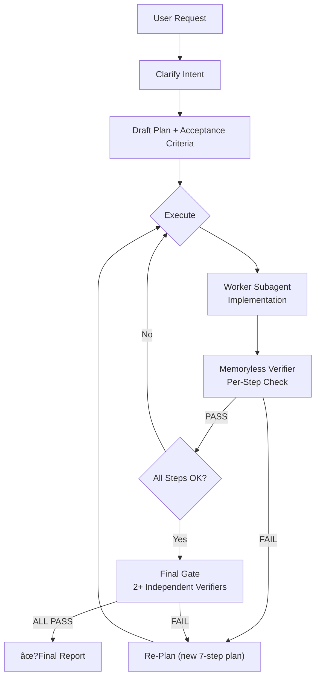

<p align="center">
  
</p>

<h1 align="center">🛡�Plan Guardian</h1>

<p align="center">
  <strong>Strict planning · Memoryless verification · Subagent-first execution</strong><br/>
  A Codex skill that enforces verifiable planning, then validates completion with independent memoryless subagents.
</p>

<p align="center">
  
  
  
  
</p>

---

## 📖 What It Does

Plan Guardian is a **Codex skill** that wraps every user request in a strict 7-step planning and verification workflow. Instead of letting Codex respond directly, it forces a closed-loop process: plan �execute �verify �report.

### Core Functionality

| Function | Description |
|----------|-------------|
| **Strict Planning** | Every request produces exactly 7 numbered steps with deliverables, dependencies, and risks |
| **Acceptance Criteria** | Each step gets binary pass/fail criteria defined before execution begins |
| **Worker Delegation** | Implementation is delegated to spawned worker subagents, keeping the main loop lightweight |
| **Memoryless Verification** | Independent verifier subagents (with `fork_context=false`) check each step with zero prior context |
| **Final Gate** | At least 2 independent verifiers check ALL criteria before the response is delivered |
| **Re-Planning Protocol** | On failure, a new plan is drafted (not blind retry) and re-verified until all pass or 3 cycles exhausted |
| **Multimodal Detection** | Step 0 probes the model API to determine image support, then applies the result to all worker/verifier model selections |

### Why Use It?

- Eliminates silent failures on complex tasks
- Prevents self-verification bias (main loop never checks its own work)
- Forces observable, binary acceptance criteria before execution starts
- Scales to multi-file, multi-step tasks with parallel worker subagents

---

## �Why Plan Guardian?

Complex tasks fail silently when plans are loose and verification is shallow. Plan Guardian eliminates that by forcing a **closed-loop workflow**:

- � **Strict Planning** �Every request starts with a numbered plan, dependencies, and acceptance criteria
- 🤖 **Subagent-First** �Main loop stays lightweight; workers and verifiers handle the heavy lifting
- � **Memoryless Verification** �Independent subagents verify completion with zero prior context
- 🧠 **Multimodal-First** �Workers prefer multimodal models; verifiers always use them
- 🔄 **Re-Planning Protocol** �When verification fails, a new plan is drafted (not blind retry) and re-verified until all pass

---

## ��Architecture



---

## 🚀 Quick Start

There are **two installation levels**. Choose based on how you want the skill to behave.

### System Level �Auto-activates on every request (Recommended)

```bash
# Linux/macOS
cp -r plan-guardian-skill ~/.codex/skills/.system/plan-guardian

# Windows (PowerShell)
robocopy plan-guardian-skill "$env:USERPROFILE\.codex\skills\.system\plan-guardian" /E
```

- Codex loads this on **every request** automatically �no exceptions
- The 7-step workflow (Step 0 �Step 7) applies to all tasks, including simple questions
- Skill appears as `plan-guardian` in Codex's system skills list
- **This is the forced mode �no way to skip it once installed**

### User Level �Manual invocation only

```bash
# Linux/macOS
cp -r plan-guardian-skill ~/.codex/skills/plan-guardian

# Windows (PowerShell)
robocopy plan-guardian-skill "$env:USERPROFILE\.codex\skills\plan-guardian" /E
```

- **Not** automatically activated �you choose when to use it
- Invoke explicitly with `$plan-guardian <your task>`
- Use when you want strict planning only for complex tasks

### Usage (User Level)

```
$plan-guardian implement a multi-file refactoring with tests
```

### Validate Installation

```bash
python scripts/validate_skill.py .
```

---

## 📋 How It Works

| Step | What Happens | Who Does It |
|------|-------------|-------------|
| **0. Detect Model Capabilities** | Probe whether current model supports multimodal (image) input | Diagnostic Subagent |
| **1. Clarify Intent** | Restate user request in one paragraph | Main Loop |
| **2. Draft Plan** | Exactly 7 numbered steps with dependencies, risks, and deliverables | Main Loop |
| **3. Acceptance Criteria** | Binary pass/fail criteria for every step | Main Loop |
| **4. Execute** | Delegate all steps to Worker subagents | **Worker Subagent** |
| **5. Per-Step Verification** | Independent memoryless verifier checks each step | **Verifier Subagent** |
| **6. Final Gate** | � memoryless verifiers check ALL criteria | **Verifier Subagents** |
| **7. Report** | Present plan, status, evidence, and remediation actions | Main Loop |

---

## 🧩 Subagent Roles

### Planner (Main Loop)
- Clarifies intent, drafts plan, coordinates execution
- **Never** pastes large files or logs �delegates to workers
- **Never** self-verifies �all verification uses spawn_agent

### Worker Subagents
- Implement, build, fix, edit, inspect files, run tests
- **Prefer multimodal model by default** �fall back to parent for pure text/code only
- **Visual rule**: MUST use multimodal model for image/UI/PDF tasks

### Verifier Subagents
- Independent, memoryless (`fork_context=false`)
- Receive only: deliverables + acceptance criteria
- Output: `PASS` or `FAIL` with exact reason
- **Always use multimodal model** �code, files, and artifacts all benefit from visual understanding

---

## 🔧 Model Selection

```
Step 0 detection result:
├── MULTIMODAL   �All workers/verifiers inherit parent model
├── NOT_MULTIMODAL �Visual tasks override to multimodal model; text tasks inherit
└── UNKNOWN      �Assume multimodal, inherit parent model
```

---

## �� Timeout Rules

| Verifier Type | timeout_ms | Retry |
|---------------|-----------|-------|
| Per-step (Step 5) | 120,000 (2 min) | +60s each retry |
| Final gate (Step 6) | 180,000 (3 min) | +60s each retry |
| Maximum | 360,000 (6 min) | �|

---

## � Structure

```
plan-guardian-skill/
├── SKILL.md                              # Core skill instructions (7-step workflow)
├── AGENTS.md                             # Repo-level agent guidelines
├── agents/
�  └── openai.yaml                       # UI metadata (display name, icon, default prompt)
├── assets/
�  ├── plan-guardian-small.svg           # Small icon
�  ├── logo.png                          # Large icon
�  └── logo.svg                          # Vector logo
├── references/
�  ├── memoryless_review.md              # Strict verifier protocol & independence rules
�  └── plan_protocol.md                  # Acceptance criteria patterns & verifier prompt template
├── scripts/
�  ├── detect_multimodal.py              # Runtime multimodal model detection via API probe
�  ├── plan_guardian.py                  # Sample plan generator (demo/testing)
�  └── validate_skill.py                 # Local validator (checks SKILL.md frontmatter & required files)
├── LICENSE                               # MIT license
└── README.md                             # This file
```

---

## 🛡�Hard Rules

1. �Never respond to the user without completing the Final Gate (Step 6)
2. �Never self-verify �all verification uses `spawn_agent` with `fork_context=false`
3. �Never reuse a verifier that returned FAIL �follow the Re-Planning Protocol
4. �Never pass conversation history to verifiers �they get deliverables + criteria only
5. �Never assume a step passed without verifier evidence
6. �Plan must have **exactly 7 steps** �no shortcuts
7. �If two final verifiers disagree �spawn a third
8. �When verification fails �Re-Planning Protocol, never blind retry
9. �After 3 re-plan cycles �escalate honestly, never silently give up
10. �If a verifier times out �treat as FAIL, increase timeout by 60s, retry with new verifier

---

## 📜 License

MIT �Use it, fork it, improve it.

---

<p align="center">
  <sub>Built for <a href="https://github.com/openai/codex">Codex</a> · Enforcing rigor since 2026</sub>
</p>
